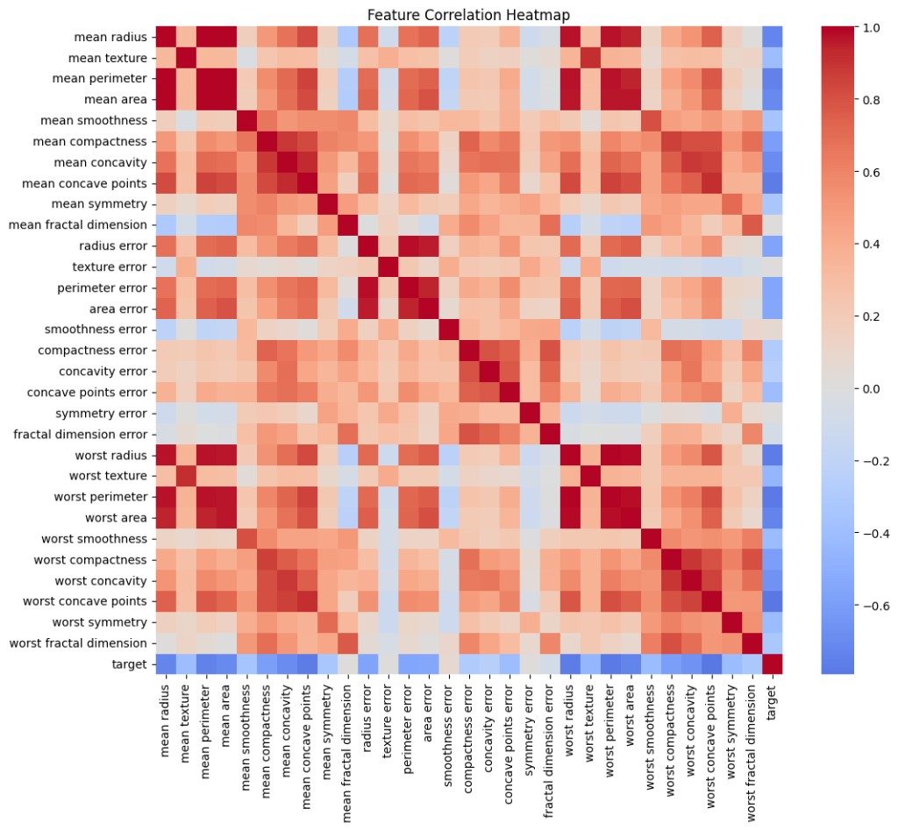
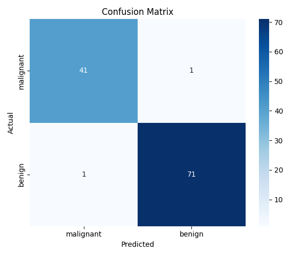
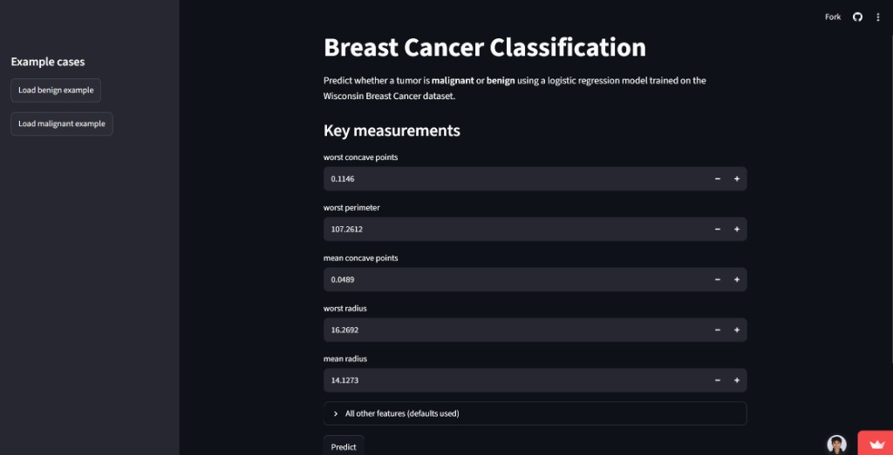
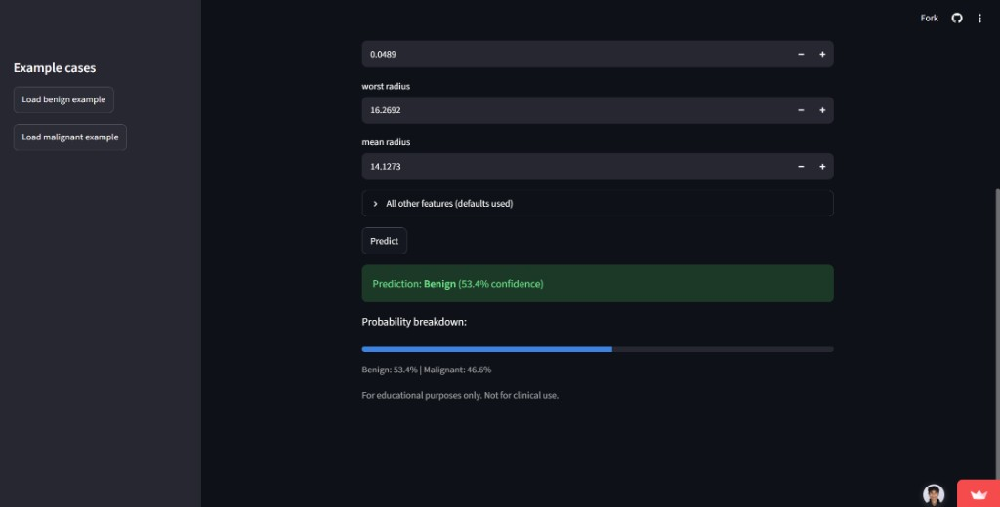

# Breast Cancer Classification

End-to-end machine learning project that predicts whether a breast tumor is **malignant** or **benign** from cell nucleus measurements — with **98.25% test accuracy** and an interactive **Streamlit** demo.

**Live demo:** [https://breast-cancer-classification-hdjanca1.streamlit.app/]

**Repository:** [github.com/shivaak67/breast-cancer-classification](https://github.com/shivaak67/breast-cancer-classification)

---

## Highlights

- Built a full ML pipeline: EDA → preprocessing → modeling → evaluation → deployment
- Trained and compared **logistic regression** and **random forest** on the Wisconsin Breast Cancer dataset (569 samples, 30 features)
- Deployed an interactive web app for real-time predictions with confidence scores
- Refactored notebook work into reusable Python scripts (`src/`)

---

## Results

| Model | Test accuracy |
|-------|---------------|
| Logistic Regression | **98.25%** |
| Random Forest | 95.61% |

| Class | Precision | Recall | F1-score |
|-------|-----------|--------|----------|
| Malignant | 0.98 | 0.98 | 0.98 |
| Benign | 0.99 | 0.99 | 0.99 |

Only **2 misclassifications** out of 114 test samples.

---

## Screenshots

### Exploratory data analysis



### Model evaluation



### Streamlit app





---

## Approach

1. **EDA** — Explored class balance, missing values, feature correlations, and distributions by diagnosis
2. **Preprocessing** — Stratified 80/20 train/test split; `StandardScaler` fit on training data only
3. **Modeling** — Logistic regression (primary) and random forest (baseline comparison)
4. **Evaluation** — Accuracy, confusion matrix, and classification report on held-out test data
5. **Deployment** — Streamlit app using a saved model and scaler for interactive predictions

**Dataset:** [Wisconsin Breast Cancer](https://scikit-learn.org/stable/modules/generated/sklearn.datasets.load_breast_cancer.html) (scikit-learn) — 569 samples, 30 numeric features, ~63% benign / ~37% malignant

---

## Tech stack

Python · pandas · scikit-learn · matplotlib · seaborn · Streamlit · joblib

---

## Project structure

```
breast-cancer-ml/
├── app.py                      # Streamlit demo
├── notebooks/
│   ├── 1_eda.ipynb             # Exploratory data analysis
│   ├── 2_preprocessing.ipynb   # Train/test split and scaling
│   └── 3_modeling.ipynb        # Model training and evaluation
├── src/
│   ├── preprocess.py           # Load data, split, scale
│   ├── train.py                # Train and save model
│   └── evaluate.py             # Evaluate and save metrics/plots
├── models/saved_models/        # Trained model and scaler (.pkl)
├── outputs/
│   ├── figures/                # Saved plots
│   └── results/                # Saved metrics
├── data/
│   ├── raw/                    # Reserved for raw data files
│   └── processed/              # Reserved for processed data files
├── docs/images/                # README screenshots
├── requirements.txt
└── README.md
```

---

## Run locally

```bash
git clone https://github.com/shivaak67/breast-cancer-classification.git
cd breast-cancer-classification
pip install -r requirements.txt
python -m streamlit run app.py
```

Pretrained model files are included — no training step required to run the app.

---

## Disclaimer

This project is for **educational and portfolio purposes only**. It is not intended for clinical use or medical decision-making.

---

## Author

Shivaa Karthikgavaskar — [GitHub](https://github.com/shivaak67)
